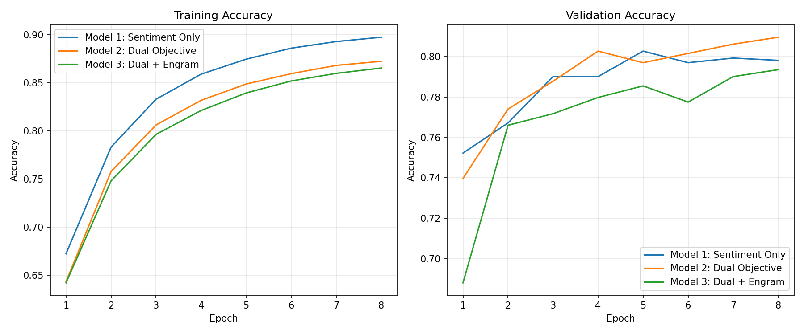
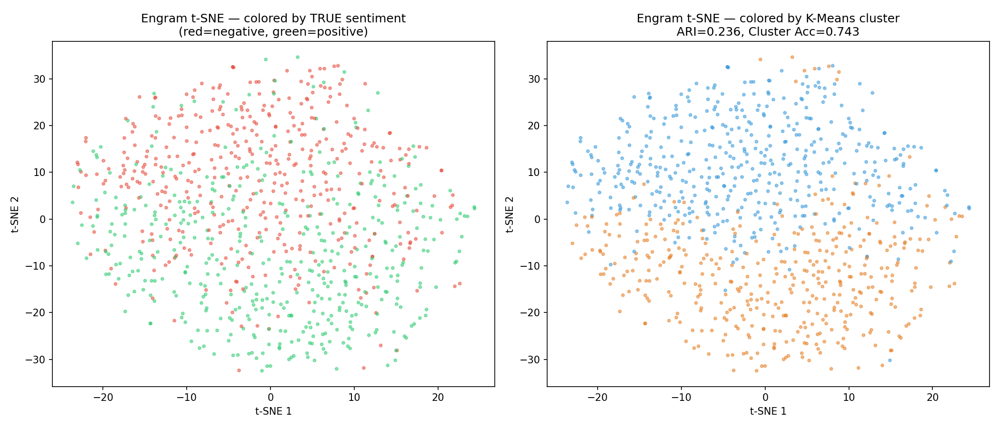
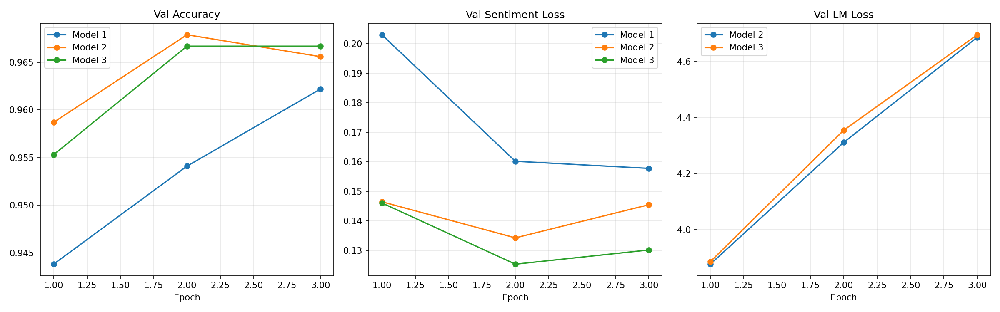
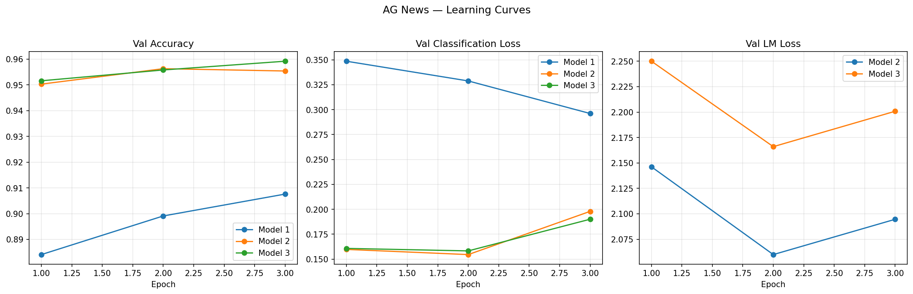
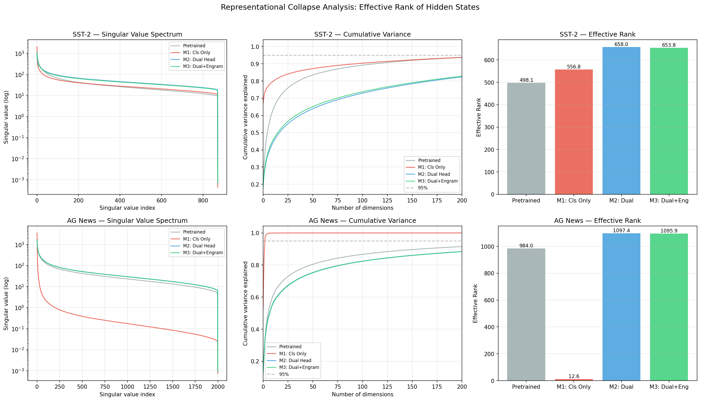

# Generative Auxiliary Training as Anti-Collapse Regularization in Large Language Models

## Overview

When you fine-tune a large language model for classification, single-objective training permits the model to collapse its representations into a narrow subspace — discarding everything except what the classification task demands. This study demonstrates that keeping the language modeling head active during fine-tuning prevents this collapse, and that the regularization benefit scales with task complexity.

We test three architectures across three experimental conditions: a small model from scratch (1.3M parameters on SST-2), a 7B model fine-tuned on SST-2 (binary sentiment), and a 7B model fine-tuned on AG News (four-class topic classification). We directly measure representational collapse via singular value decomposition, confirming the anti-collapse mechanism as demonstrated fact rather than plausible explanation.

### Models

| # | Architecture | Description |
|---|---|---|
| 1 | **Classification Only** | Baseline — backbone trained with a single classification head |
| 2 | **Dual Head** | Shared backbone with both a classification head and a next-token prediction (LM) head; combined loss = 0.5 * LM + 0.5 * classification |
| 3 | **Dual + Engram** | Same as Model 2, plus a compressed bottleneck representation ("engram") extracted from the classifier's intermediate layer, fed back as a learned prefix embedding on the next input |

### Hypotheses

- **H1**: The dual objective acts as a regularizer, preventing representational collapse in the shared backbone.
- **H2**: The regularization benefit scales with task complexity — larger gains on harder classification problems.
- **H3**: Engram representations will naturally organize around the most task-salient dimension, even without explicit supervision on the bottleneck.
- **H4**: Single-objective fine-tuning produces measurably lower effective rank in the hidden states than dual-objective training.

---

## Experiment 1: Small Model (from scratch)

### Setup

- **Backbone**: 2-layer transformer, 128-dim embeddings, 4 attention heads (~1.3M parameters)
- **Vocabulary**: Word-level, built from training data
- **Engram dimension**: 32
- **Training**: 8 epochs, Adam optimizer, lr=3e-4, batch size=64
- **Dataset**: SST-2 (67,349 train / 872 validation)

### Results

| Model | Best Val Accuracy | Final Val Accuracy |
|---|:-:|:-:|
| Model 1: Classification Only | 80.28% | 79.82% |
| Model 2: Dual Head | **80.96%** | **80.96%** |
| Model 3: Dual + Engram | 79.36% | 79.36% |

**Model 2 vs 1: +0.69%** — The dual objective provides a small regularization benefit.

**Model 3 vs 2: -1.61%** — The engram feedback hurt performance. At this scale the backbone has limited capacity, and the engram prefix likely introduces noise that competes with the model's ability to attend to the actual input tokens.

### Engram Clustering

| Metric | Value |
|---|:-:|
| Adjusted Rand Index | 0.236 |
| Cluster Accuracy | 74.3% |

The engram representations show weak but above-chance separation of positive and negative sentiment. The 32-dimensional bottleneck captures some sentiment signal but is far from cleanly organized.

### Learning Curves



### Engram t-SNE



---

## Experiment 2: 7B Model on SST-2 (Binary Sentiment)

### Setup

- **Base model**: Qwen2.5-7B
- **Quantization**: 4-bit NF4 with double quantization (BitsAndBytes)
- **Fine-tuning**: LoRA rank=16, alpha=32, applied to q_proj, k_proj, v_proj, o_proj, gate_proj, up_proj, down_proj
- **Classification head**: Linear(3584→256) → GELU → Dropout(0.1) → Linear(256→2), trained in fp32
- **Engram compressor**: Linear(3584→128) → Tanh, trained in fp32
- **Engram projector**: Linear(128→3584), maps engram back to embedding space as a prefix token
- **Training**: 3 epochs, AdamW, lr=2e-4, cosine schedule with warmup, gradient checkpointing
- **Combined loss**: 0.5 * LM_loss + 0.5 * classification_loss (Models 2 and 3)
- **VRAM**: 16GB (RTX 4080)
- **Dataset**: SST-2 (67,349 train / 872 validation)
- **Trainable parameters**: ~41M / 4.4B total (0.94%)

### Results

| Model | Epoch 1 | Epoch 2 | Epoch 3 | Best | Time |
|---|:-:|:-:|:-:|:-:|:-:|
| Model 1: Classification Only | 94.38% | 95.41% | **96.22%** | **96.22%** | 380 min |
| Model 2: Dual Head | 95.87% | **96.79%** | 96.56% | **96.79%** | 417 min |
| Model 3: Dual + Engram | 95.53% | **96.67%** | 96.67% | **96.67%** | 635 min |

**Model 2 vs 1: +0.57%** — The dual objective provides a regularization benefit. Model 2 peaks at epoch 2 and begins to overfit slightly at epoch 3, while Model 1 is still improving — suggesting the LM head helps the model converge faster to a better representation.

**Model 3 vs 2: -0.12%** — Negligible difference. The engram provides no accuracy benefit on independent sentences.

### Engram Clustering

| Metric | Value |
|---|:-:|
| Adjusted Rand Index | 0.833 |
| Cluster Accuracy | 95.64% |
| Within-class cosine similarity | 0.953 |
| Between-class cosine similarity | 0.838 |


The 128-dimensional engram representations form two well-separated clusters that align almost perfectly with sentiment polarity — without any explicit clustering loss.

### Learning Curves



---

## Experiment 3: 7B Model on AG News (Four-Class Topic Classification)

This experiment tests whether the dual-objective mechanism generalizes beyond sentiment. If the anti-collapse hypothesis is correct, the regularization benefit should be larger on the harder four-class problem, and the engram should organize around topic categories rather than sentiment.

### Setup

Identical to Experiment 2 except:

- **Dataset**: AG News (120,000 train / 7,600 test-as-validation)
- **Classes**: 4 (World, Sports, Business, Sci/Tech)
- **Classification head**: Linear(3584→256) → GELU → Dropout(0.1) → Linear(256→4)
- **Engram compressor**: Linear(256→128) → Tanh (taps the classifier's 256-dim intermediate representation rather than the raw 3584-dim hidden state)
- **Max sequence length**: 256 (vs 128 for SST-2)

### Results

| Model | Epoch 1 | Epoch 2 | Epoch 3 | Best | Time |
|---|:-:|:-:|:-:|:-:|:-:|
| Model 1: Classification Only | 88.41% | 89.91% | **90.76%** | **90.76%** | 1358 min |
| Model 2: Dual Head | 95.03% | **95.63%** | 95.54% | **95.63%** | 1488 min |
| Model 3: Dual + Engram | 95.16% | 95.58% | **95.92%** | **95.92%** | 1953 min |

**Model 2 vs 1: +4.78%** — Fourteen times the SST-2 effect. The dual objective prevents the representational collapse that four-class classification induces.

**Model 3 vs 2: +0.38%** — A small positive gain. The engram slightly helps on AG News, unlike SST-2 where it was neutral.

### Training Dynamics

| Model | Train Cls Loss (E3) | Train LM Loss (E3) | Train Acc (E3) |
|---|:-:|:-:|:-:|
| Model 1 | 0.278 | — | 91.13% |
| Model 2 | 0.036 | 1.552 | 98.83% |
| Model 3 | 0.036 | 1.689 | 98.81% |

Model 2 and 3 achieve dramatically lower classification loss (0.036 vs 0.278) and higher training accuracy than Model 1, despite sharing compute with the LM objective.

### Engram Clustering

| Metric | Value |
|---|:-:|
| Adjusted Rand Index | 0.889 |
| Cluster Accuracy | 95.64% |
| Within-class cosine similarity | 0.862 |
| Between-class cosine similarity | 0.576 |

| Class | Count | Purity |
|---|:-:|:-:|
| Sports | 1,900 | 99.4% |
| World | 1,900 | 95.7% |
| Sci/Tech | 1,900 | 94.0% |
| Business | 1,900 | 93.4% |


The engram clusters align with topic categories, not sentiment. The K-Means cluster-to-class mapping (via Hungarian algorithm) recovers all four topics with high purity. The between-class cosine similarity (0.576) is much lower than SST-2 (0.838), meaning the four topic clusters are better separated from each other than the two sentiment clusters — consistent with the bottleneck organizing around a richer, multi-dimensional structure.

### Learning Curves



---

## Experiment 4: Effective Rank Analysis

This experiment directly measures representational collapse by computing the singular value spectrum of the hidden states across all trained models.

### Method

For each model (pretrained baseline, Models 1-3) on each dataset, we:

1. Ran 2,000 validation samples through the backbone
2. Collected mean-pooled hidden states (3,584-dim vectors)
3. Computed SVD of the centered hidden state matrix
4. Derived effective rank: exp(entropy of normalized singular values)
5. Derived additional metrics: stable rank, participation ratio, dimensions needed for 95% variance

### Results

| Model | SST-2 Eff. Rank | SST-2 Dims@95% | AG News Eff. Rank | AG News Dims@95% |
|---|:-:|:-:|:-:|:-:|
| **Pretrained (no fine-tuning)** | 498.1 | 249 | 984.0 | 374 |
| **Model 1: Cls Only** | 556.8 | 261 | **12.6** | **3** |
| **Model 2: Dual Head** | 658.0 | 510 | **1097.4** | **515** |
| **Model 3: Dual + Engram** | 653.8 | 506 | 1095.9 | 516 |

| Model | SST-2 Stable Rank | SST-2 Part. Ratio | AG News Stable Rank | AG News Part. Ratio |
|---|:-:|:-:|:-:|:-:|
| **Pretrained** | 5.5 | 224.3 | 7.1 | 375.3 |
| **Model 1: Cls Only** | 1.5 | 163.6 | 1.9 | 5.2 |
| **Model 2: Dual Head** | 5.0 | 408.6 | 8.1 | 464.4 |
| **Model 3: Dual + Engram** | 5.4 | 400.6 | 8.1 | 466.2 |



### Interpretation

**AG News Model 1 is the smoking gun.** Single-objective fine-tuning on four-class topic classification collapses the model's representations from an effective rank of 984 (pretrained) to 12.6. Only 3 dimensions capture 95% of the variance. The model learned a four-class problem and discarded everything else.

**The dual objective prevents collapse.** Model 2 on AG News recovers to an effective rank of 1097 — actually exceeding the pretrained baseline. The language modeling head forces the backbone to maintain distributed representations needed for text generation, and those representations carry the subtle distinctions that multi-class classification needs.

**The effect scales with task complexity.** On SST-2, Model 1 shows mild collapse (effective rank rises slightly from 498 to 557, but stable rank drops from 5.5 to 1.5 and participation ratio drops from 224 to 164). On AG News, the collapse is catastrophic. The dual objective recovers effectively all of the lost dimensionality in both cases.

**The engram does not affect representational rank.** Models 2 and 3 have nearly identical effective rank on both datasets (658 vs 654 on SST-2; 1097 vs 1096 on AG News). The engram's value is in interpretability, not in shaping backbone representations.

---

## Cross-Dataset Comparison

### Accuracy

| Model | SST-2 (2-class) | AG News (4-class) |
|---|:-:|:-:|
| Model 1: Cls Only | 96.22% | 90.76% |
| Model 2: Dual Head | 96.56% | 95.54% |
| Model 3: Dual + Engram | 96.67% | 95.92% |
| **Dual-objective gain (M2-M1)** | **+0.34%** | **+4.78%** |
| Engram delta (M3-M2) | +0.11% | +0.38% |

The regularization benefit is fourteen times larger on the four-class problem. This scaling pattern is a specific prediction of the anti-collapse hypothesis and not a prediction of simpler alternatives (e.g., "more gradient signal helps everywhere equally").

### Engram Clustering

| Metric | SST-2 (sentiment) | AG News (topic) |
|---|:-:|:-:|
| Adjusted Rand Index | 0.833 | 0.889 |
| Cluster Accuracy | 95.64% | 95.64% |
| Within-class cosine similarity | 0.953 | 0.862 |
| Between-class cosine similarity | 0.838 | 0.576 |

The engram bottleneck achieves 95.6% cluster accuracy on both tasks with zero supervision on the compressed space. On SST-2, the bottleneck organizes around sentiment. On AG News, it organizes around topic. The mechanism is gradient-weighted feature selection under compression — the bottleneck preserves whatever dimension carries the strongest shared gradient from both objectives.

### Representational Collapse

| Metric | SST-2 | AG News |
|---|:-:|:-:|
| Pretrained effective rank | 498.1 | 984.0 |
| Model 1 effective rank | 556.8 | **12.6** |
| Model 2 effective rank | 658.0 | 1097.4 |
| Collapse (Pre → M1) | +58.7 | **-971.4** |
| Recovery (M1 → M2) | +101.1 | **+1084.8** |

---

## Conclusions

1. **Representational collapse is real and measurable.** Single-objective fine-tuning on AG News collapses effective rank from 984 to 12.6 — a 98.7% reduction. The model retains only 3 effective dimensions for a four-class problem. On SST-2, the collapse is milder because binary classification demands less representational narrowing.

2. **The dual objective prevents collapse.** Adding a language modeling head recovers and exceeds the pretrained effective rank (1097 vs 984 on AG News). The LM objective forces the backbone to maintain distributed representations needed for text generation, which also carry the subtle distinctions that classification needs.

3. **The anti-collapse benefit scales with task complexity.** The accuracy gain from dual-objective training is 14x larger on four-class AG News (+4.78%) than on binary SST-2 (+0.34%). This scaling is a specific prediction of the collapse-prevention mechanism: harder tasks induce more collapse, so there is more to prevent.

4. **Engram bottlenecks provide structural interpretability.** The engram spontaneously organizes around the most task-salient dimension — sentiment on SST-2 (ARI=0.833), topic on AG News (ARI=0.889) — with 95.6% cluster accuracy on both tasks and zero supervision on the compressed space. The bottleneck performs gradient-weighted feature selection, preserving whatever dimension carries the strongest shared gradient from both objectives.

5. **Engrams do not affect representational rank.** Models 2 and 3 have nearly identical effective rank, confirming that the engram's value is interpretability, not anti-collapse. The dual objective alone is sufficient to prevent collapse.

6. **Practical recommendation.** When fine-tuning a large language model for classification, keep the language modeling head active. The cost is modest. On simple binary tasks, expect small gains. On multi-class tasks with complex decision boundaries, expect substantially larger gains — nearly five percentage points on a standard four-class benchmark.

---

## Limitations and Future Work

- **Loss weighting.** We used equal weights (0.5/0.5) for the classification and language modeling objectives without sweeping this hyperparameter. The loss scales differ (cross-entropy over 4 classes vs 150k+ vocab), so equal weighting is not theoretically motivated — a sweep would likely find a better ratio. The results here are a lower bound.

- **Compute-matched controls.** We did not train classification-only for double the steps or train with a shuffled language modeling objective. Either control would more conclusively rule out the "more gradients" explanation. The effective rank measurements provide strong evidence, but compute-matched controls would complete the causal story.

- **Two datasets.** The prediction that the regularization effect scales with task complexity needs validation on tasks with more classes. If the theory is correct, the benefit should continue to grow with class count.

- **The AG News Model 1 baseline (90.76%) is conservative.** Qwen2.5-7B should achieve higher with optimized hyperparameters. The same hyperparameters were used across all models, so the comparison is fair, but the absolute numbers are not state-of-the-art.

---

## Reproduction

```bash
# Small model experiment (~30 minutes on GPU)
python3 experiment.py

# 7B QLoRA on SST-2 (~24 hours on RTX 4080 16GB)
python3 experiment_7b.py

# 7B QLoRA on AG News (~80 hours on RTX 4080 16GB)
python3 experiment_agnews_7b.py

# Effective rank analysis (~20 minutes, requires trained checkpoints)
python3 effective_rank_analysis.py
```

### Requirements

- Python 3.10+
- PyTorch 2.x with CUDA
- transformers, peft, bitsandbytes, datasets
- scikit-learn, scipy, matplotlib, numpy

### Hardware

- Small model: Any GPU with 2GB+ VRAM (or CPU)
- 7B models: GPU with 16GB+ VRAM (tested on RTX 4080)

### Code

https://github.com/MikeyBeez/sentiment
