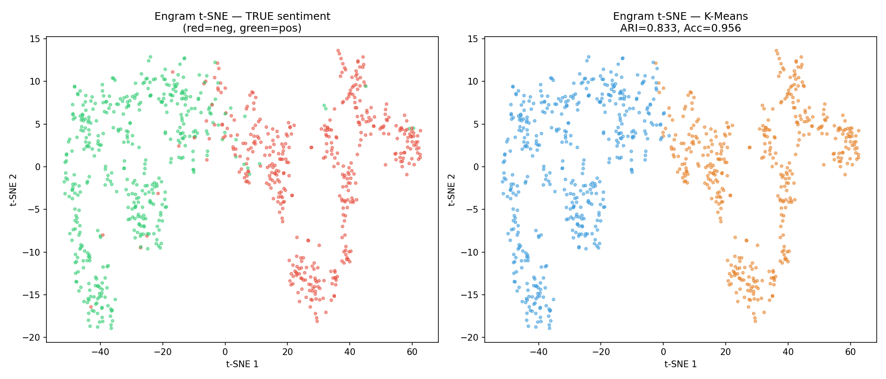
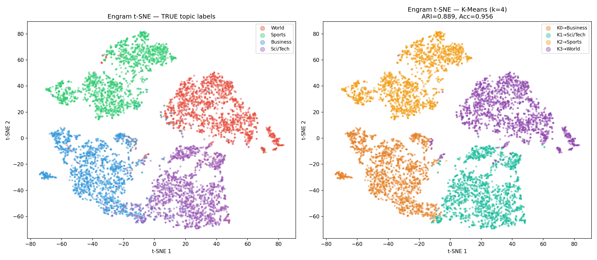

# Dual-Objective Training and Spontaneous Evaluative Encoding at Scale

When you compress a neural network's hidden state through a narrow bottleneck, what survives? This repo contains the experiments showing that a bottleneck trained under dual objectives spontaneously organizes its compressed representations around the most task-salient dimension of the input — sentiment polarity on SST-2, topic categories on AG News — with no clustering loss, no supervision on the bottleneck, and no explicit instruction to encode that structure.

## Key Results

### Cross-Dataset Comparison (7B scale, Qwen2.5-7B + QLoRA)

| Metric | SST-2 (2-class sentiment) | AG News (4-class topic) |
|--------|--------------------------|------------------------|
| Model 1 val accuracy (cls only) | 96.22% | 90.76% |
| Model 2 val accuracy (dual head) | 96.56% | 95.54% |
| Model 3 val accuracy (dual + engram) | 96.67% | 95.92% |
| Dual-objective gain (M2 - M1) | +0.34% | +4.78% |
| Engram delta (M3 - M2) | +0.11% | +0.38% |
| **Engram ARI** | **0.833** | **0.889** |
| **Engram cluster accuracy** | **95.64%** | **95.64%** |
| Engram cos within-class | 0.953 | 0.862 |
| Engram cos between-class | 0.838 | 0.576 |

The engram bottleneck achieves 95.6% cluster accuracy on **both** tasks with zero supervision on the compressed space. On AG News, the 4 topic clusters (World, Sports, Business, Sci/Tech) separate cleanly — Sports at 99.4% purity, World at 95.7%, Sci/Tech at 94.0%, Business at 93.4%.

### Engram Cluster Visualizations

**SST-2 (sentiment polarity)**


**AG News (topic categories)**


## Three Models

| # | Architecture | Description |
|---|-------------|-------------|
| 1 | **Classification Only** | LoRA backbone + classification head |
| 2 | **Dual Head** | Backbone + classification head + next-token prediction head; loss = 0.5 * LM + 0.5 * cls |
| 3 | **Dual + Engram** | Same as Model 2 + bottleneck compressor that feeds back as a prefix token |

## Architecture Details

- **Base model**: Qwen2.5-7B, 4-bit NF4 quantization (BitsAndBytes)
- **LoRA**: rank 16, alpha 32, applied to q/k/v/o/gate/up/down projections (~41M trainable params, <1% of total)
- **Classification head**: Linear(3584→256) → GELU → Dropout(0.1) → Linear(256→num_classes)
- **Engram compressor**: Linear(256→128) → Tanh (taps the classifier's intermediate representation)
- **Engram projector**: Linear(128→3584), prepended as prefix token
- **Training**: 3 epochs, AdamW, lr=2e-4, cosine schedule with warmup

The engram extracts from the classifier's 256-dim intermediate layer rather than the raw 3584-dim hidden state, giving it a representation already shaped by classification gradients (2:1 compression vs 28:1).

## Experiments

### Small scale (1.3M params, from scratch)
- `experiment.py` — 2-layer transformer on SST-2
- Results in `results/`

### 7B scale — SST-2
- `experiment_7b.py` — Qwen2.5-7B + QLoRA on SST-2 (binary sentiment)
- Results in `results_7b/`

### 7B scale — AG News
- `experiment_agnews_7b.py` — Qwen2.5-7B + QLoRA on AG News (4-class topic)
- Results in `results_agnews/`

## Why This Happens

The bottleneck performs gradient-weighted dimensionality reduction. Gradients from both the classification and language modeling heads flow through the shared backbone into the compressor. The compression must prioritize — it preserves directions with highest gradient energy from both objectives and discards the rest. Evaluative valence (on SST-2) and topic category (on AG News) carry high gradient magnitude for both heads simultaneously, so the bottleneck converges on these as its primary organizing principles.

This predicts that the same architecture on any classification + LM task will produce engram clusters aligned with whatever dimension is most informative for both objectives.

## Requirements

```
torch
transformers
peft
bitsandbytes
datasets
scikit-learn
scipy
matplotlib
tqdm
numpy
```

## Hardware

Tested on a single GPU with 16GB VRAM. Training time per experiment (3 models x 3 epochs):
- SST-2 7B: ~24 hours
- AG News 7B: ~80 hours (larger dataset, longer sequences)

## Paper

See `FINDINGS.md` for the detailed writeup.

## License

MIT
